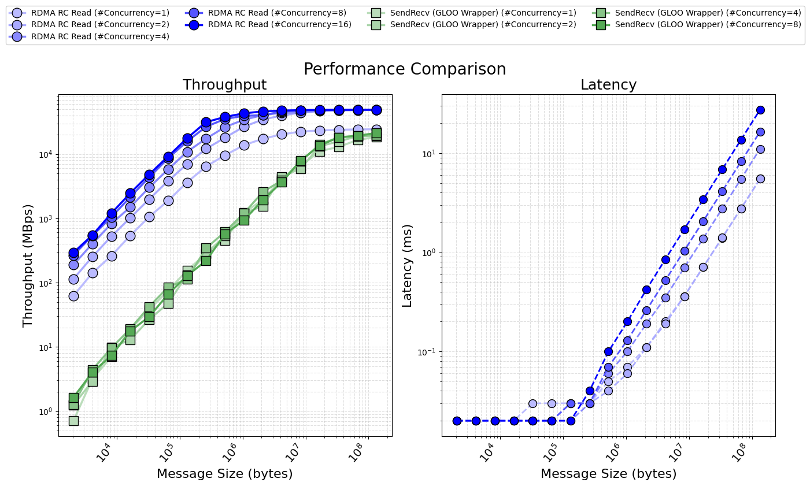

# DLSlime Transfer Engine

A Peer to Peer RDMA Transfer Engine.

## Install

```bash
### pip install
pip install dlslime==0.0.1.post7

### Build from source
BUILD_NVLINK=<OFF|ON> BUILD_TORCH_PLUGIN=<OFF|ON> pip install -v --no-build-isolation -e .
```

## Usage

- IPC Read by NVLink
  - [example](example/python/p2p_nvlink.py)
- RDMA RC Read
  - [example](example/python/p2p_rdma.py)
  - bench (single NIC): [cpp](bench/cpp/transfer_bench.cpp), [python](bench/python/transfer_bench.py)
  - bench (Aggregated Transport): [cpp](bench/cpp/scheduler_bench.cpp)
- RDMA SendRecv (GLOO Wrapper)
  - [example](example/python/sendrecv.py)
  - bench: [python](bench/python/sendrecv_bench.py)

## Cross node performance

### Benchmark

- NVIDIA ConnectX-7 HHHL Adapter Card; 200GbE (default mode) / NDR200 IB; Dual-port QSFP112; PCIe 5.0 x16 with x16 PCIe extension option;
- RoCE v2.


