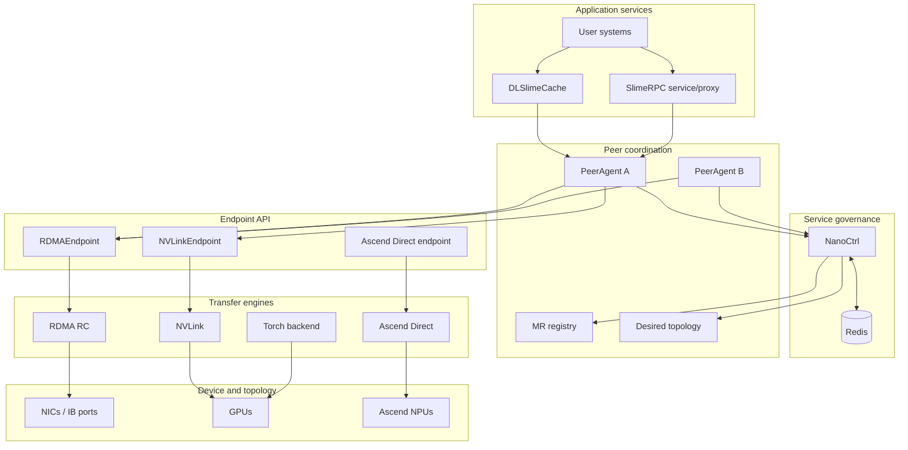

<div align="center">
  
</div>
<p align="center">
  <a href="docs/roadmap.md"> Roadmap </a> |
  <a href="https://join.slack.com/t/dlslime/shared_invite/zt-3e9zvercw-a89KI_Ig8N1UTaol_q6MXg"> Slack </a> |
  <a href="docs/imgs/assets/wechat_qrcode.jpg"> WeChat Group </a> |
  <a href="https://zhuanlan.zhihu.com/p/1950701795149067622"> Zhihu </a>
</p>
<h2 align="center"> Flexible & Efficient Heterogeneous Transfer Toolkit </h2>

DLSlime is a layered communication and microservice toolkit for distributed
AI systems. It starts from heterogeneous device transports such as RDMA, NVLink,
and Ascend Direct, wraps them in endpoint and assignment APIs, then builds
PeerAgent coordination, SlimeRPC, and DLSlimeCache on top. NanoCtrl provides the
control plane for service registration, discovery, liveness, and PeerAgent/RDMA
metadata.

The goal is to let systems compose high-performance data movement without tying
application logic to one transport, one topology, or one service layout.

## Layered Architecture

DLSlime is organized as a stack. Lower layers move bytes and expose device
capabilities; upper layers coordinate peers and provide service-shaped building
blocks.

| Layer                     | Components                                             | Responsibility                                                                                           |
| ------------------------- | ------------------------------------------------------ | -------------------------------------------------------------------------------------------------------- |
| Application services      | DLSlimeCache, SlimeRPC services, user systems          | Use DLSlime as a service substrate for cache, RPC, and custom distributed components                     |
| Service governance        | NanoCtrl                                               | Register services, discover by `kind`, maintain heartbeat TTLs, scope isolation, publish Redis addresses |
| Peer coordination         | PeerAgent, desired topology, MR registry               | Discover peers, register memory regions, establish directed connections, clean stale state               |
| Endpoint API              | `RDMAEndpoint`, `NVLinkEndpoint`, Ascend endpoints     | Register local/remote memory and issue read/write/send-recv operations                                   |
| Transfer engines          | RDMA RC, NVLink, Ascend Direct, optional torch backend | Execute transport-specific data movement                                                                 |
| Device and topology layer | NIC/GPU/NPU discovery, resource records                | Describe available devices, ports, link types, and placement hints                                       |


```mermaid
graph TB
    subgraph App[Application services]
        User[User systems]
        Cache[DLSlimeCache]
        RPC[SlimeRPC service/proxy]
    end

    subgraph Ctrl[Service governance]
        NanoCtrl[NanoCtrl]
        Redis[(Redis)]
    end

    subgraph Peer[Peer coordination]
        AgentA[PeerAgent A]
        AgentB[PeerAgent B]
        MR[MR registry]
        Topology[Desired topology]
    end

    subgraph Endpoint[Endpoint API]
        RDMAEndpoint[RDMAEndpoint]
        NVLinkEndpoint[NVLinkEndpoint]
        AscendEndpoint[Ascend Direct endpoint]
    end

    subgraph Transport[Transfer engines]
        RDMA[RDMA RC]
        NVLink[NVLink]
        Ascend[Ascend Direct]
        Torch[Torch backend]
    end

    subgraph Device[Device and topology]
        NIC[NICs / IB ports]
        GPU[GPUs]
        NPU[Ascend NPUs]
    end

    User --> RPC
    User --> Cache
    Cache --> AgentA
    RPC --> AgentA
    AgentA --> NanoCtrl
    AgentB --> NanoCtrl
    NanoCtrl <--> Redis
    NanoCtrl --> MR
    NanoCtrl --> Topology
    AgentA --> RDMAEndpoint
    AgentB --> RDMAEndpoint
    AgentA --> NVLinkEndpoint
    RDMAEndpoint --> RDMA
    NVLinkEndpoint --> NVLink
    AscendEndpoint --> Ascend
    RDMA --> NIC
    NVLink --> GPU
    Ascend --> NPU
    Torch --> GPU
```

## How The Layers Work Together

1. A service starts and registers itself with NanoCtrl as a generic entity, for
   example `kind=cache` or `kind=rpc-worker`.
2. A PeerAgent registers its resource record and memory regions with NanoCtrl.
3. Clients discover services by `kind` and scope, then connect to the service or
   its PeerAgent.
4. PeerAgents exchange connection intent and memory-region metadata through
   NanoCtrl/Redis.
5. Endpoint objects issue the actual transfer through RDMA, NVLink, Ascend
   Direct, or the selected backend.
6. Higher-level components such as SlimeRPC and DLSlimeCache reuse the same
   data plane instead of inventing separate transfer paths.

## Component Map

| Component                           | Layer                     | What it does                                                                                                           |
| ----------------------------------- | ------------------------- | ---------------------------------------------------------------------------------------------------------------------- |
| `NanoCtrl/`                         | Service governance        | Rust control-plane server and Python client for service registry, heartbeat, PeerAgent coordination, and RDMA metadata |
| `dlslime.peer_agent`                | Peer coordination         | Python PeerAgent abstraction for discovery, connection management, memory registration, and read/write facade          |
| `dlslime.rpc`                       | Application service       | Service/proxy RPC helpers built over PeerAgent mailbox transport                                                       |
| `dlslime.cache`                     | Application service       | Cache service/client wrappers around assignment manifests and RDMA cache slabs                                         |
| `dlslime._slime_c`                  | Endpoint and C++ bindings | Python bindings for endpoint, assignment, cache, and transport primitives                                              |
| `dlslime/csrc/engine`               | Transfer abstraction      | Common assignment and transfer-engine interfaces                                                                       |
| `dlslime/csrc/engine/rdma`          | Transfer engine           | RDMA RC endpoint implementation                                                                                        |
| `dlslime/csrc/engine/nvlink`        | Transfer engine           | NVLink endpoint implementation                                                                                         |
| `dlslime/csrc/engine/ascend_direct` | Transfer engine           | Ascend Direct endpoint implementation                                                                                  |
| `dlslime/csrc/device`               | Device layer              | Device API, futures, signals, and platform-specific helpers                                                            |

## Common Use Cases

| Use case                           | Start here                                                    |
| ---------------------------------- | ------------------------------------------------------------- |
| Direct P2P transfer                | `RDMAEndpoint` examples under `examples/python/p2p_rdma_*`    |
| Control-plane coordinated transfer | `PeerAgent` examples under `examples/python/*_ctrl_plane.py`  |
| Python service RPC                 | `examples/python/rpc_example.py` and `dlslime.rpc`            |
| RDMA-backed cache service          | `dlslime-cache` and `examples/python/cache_client_example.py` |
| Transport benchmarking             | `bench/README.md`                                             |
| Ascend integration                 | `docs/huawei_ascend/README.md`                                |

## Install

### From PyPI

```bash
pip install dlslime==0.0.3.rc2
```

The PyPI package is built with the default CMake flags. Build from source when
you need optional transports or local C++ changes.

### From Source

```bash
git clone https://github.com/deeplink-org/DLSlime.git
cd DLSlime
pip install -v --no-build-isolation -e .
```

Pass CMake flags through the environment when enabling optional components:

```bash
BUILD_NVLINK=ON BUILD_TORCH_PLUGIN=ON \
  pip install -v --no-build-isolation -e .
```

For a pure C++ build:

```bash
cmake -S . -B build -GNinja -DBUILD_PYTHON=OFF -DBUILD_RDMA=ON
cmake --build build
```

### Build Flags

| Flag                  |                                  Default | Description                                            |
| --------------------- | ---------------------------------------: | ------------------------------------------------------ |
| `BUILD_RDMA`          |                                     `ON` | Build the RDMA transfer engine                         |
| `BUILD_PYTHON`        | `OFF` in CMake, `ON` in `pyproject.toml` | Build Python bindings                                  |
| `BUILD_NVLINK`        |                                    `OFF` | Build the NVLink transfer engine                       |
| `BUILD_ASCEND_DIRECT` |                                    `OFF` | Build Ascend Direct transport                          |
| `BUILD_TORCH_PLUGIN`  |                                    `OFF` | Build DLSlime as a torch backend                       |
| `BUILD_BENCH`         |                                    `OFF` | Build C++ transfer-engine benchmarks                   |
| `BUILD_TEST`          |                                    `OFF` | Build C++ tests                                        |
| `USE_MACA`            |                                    `OFF` | Enable Metax platform support for torch backend builds |

## Quick Start

### RDMA Endpoint

The low-level endpoint API registers local memory regions, exchanges endpoint
metadata out of band, connects peers, and issues RDMA operations.

```bash
python examples/python/p2p_rdma_rc_read.py
python examples/python/p2p_rdma_rc_write.py
python examples/python/p2p_rdma_rc_write_with_imm_data.py
python examples/python/p2p_rdma_rc_send_recv_gdr.py
```

The examples use `available_nic()` to find RDMA devices and `RDMAEndpoint` to
register local and remote memory regions.

### PeerAgent and SlimeRPC

PeerAgent adds control-plane based discovery and connection management. Start a
NanoCtrl instance first, then run the RPC example:

```bash
nanoctrl start
python examples/python/rpc_example.py --ctrl http://127.0.0.1:3000
```

The example defines a Python service, serves it on a worker PeerAgent, and
calls it from a driver PeerAgent through the SlimeRPC proxy API.

### DLSlimeCache

DLSlimeCache owns a preallocated memory region and stores assignment manifests
so clients can write bytes into cache slabs and read them back through normal
RDMA operations.

```bash
nanoctrl start
dlslime-cache start --ctrl http://127.0.0.1:3000 \
  --host 127.0.0.1 --port 8765 --memory-size 1G

python examples/python/cache_client_example.py --url http://127.0.0.1:8765

dlslime-cache stop
```

See [docs/design/dlslime-cache.md](docs/design/dlslime-cache.md) for the cache
service design and API.

### NVLink and Ascend

```bash
torchrun --nproc_per_node=2 examples/python/p2p_nvlink.py
python examples/python/p2p_ascend_read.py
```

Ascend Direct setup details live in
[docs/huawei_ascend/README.md](docs/huawei_ascend/README.md).

## Benchmarks

Benchmark commands and historical performance tables now live under the
benchmark directory:

- [bench/README.md](bench/README.md) - transfer, endpoint, cache, and RPC benchmark entry point
- [docs/benchmark-rpc.md](docs/benchmark-rpc.md) - focused SlimeRPC vs Ray benchmark guide

Common entry points:

```bash
# Aggregated RDMA transfer benchmark, two nodes
torchrun --master-addr <addr> --master-port 6006 \
  --nnodes 2 --nproc-per-node 8 --node-rank <rank> \
  bench/python/agg_transfer_bench_spmd.py \
  --qp-num 8 --transfer-engine dlslime \
  --batch-size 64 --num-iteration 100 --num-concurrency 8

# SlimeRPC vs Ray local benchmark
bash bench/python/run_rpc_bench.sh
```

## Repository Layout

```text
dlslime/          Python package and C++ sources
examples/python/  Runnable Python examples
bench/            Benchmark scripts, result files, and benchmark README
docs/             Design notes, roadmap, platform docs, and benchmark notes
tests/            Python and C++ tests
cmake/            CMake helper modules
scripts/          Development scripts
```

## Documentation

- [Documentation index](docs/README.md)
- [Roadmap](docs/roadmap.md)
- [DLSlimeCache design](docs/design/dlslime-cache.md)
- [Endpoint ownership model](docs/endpoint-ownership-model.md)
- [Endpoint DeviceSignal refactor](docs/endpoint-device-signal-refactor.md)
- [Huawei Ascend guide](docs/huawei_ascend/README.md)
- [Chinese README](README_zh.md)

## License

See [LICENSE](LICENSE).
