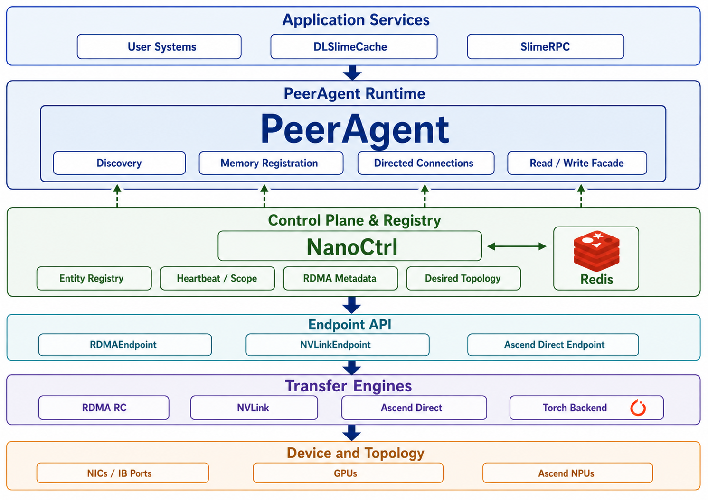
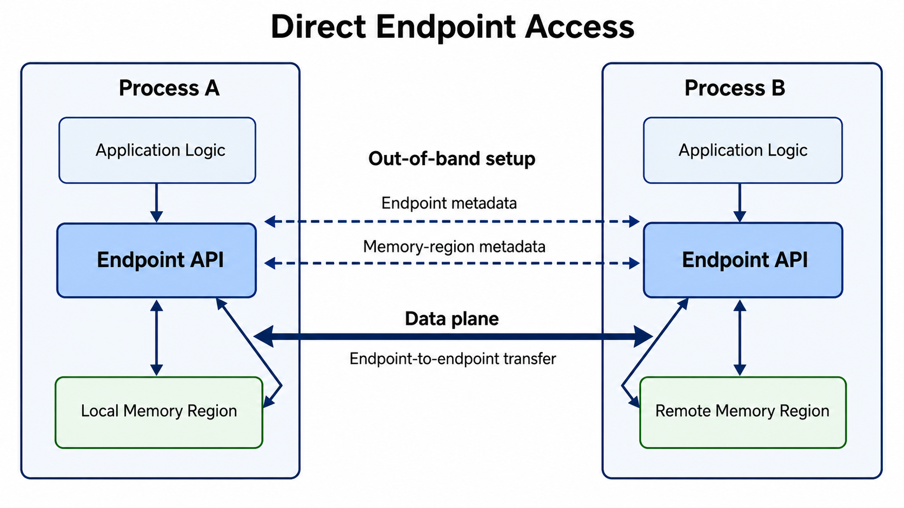
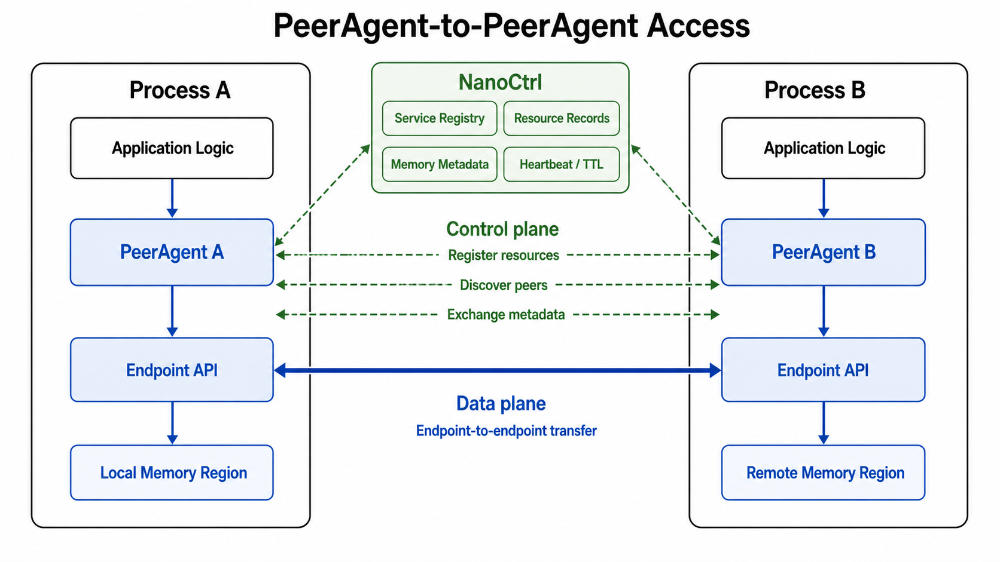
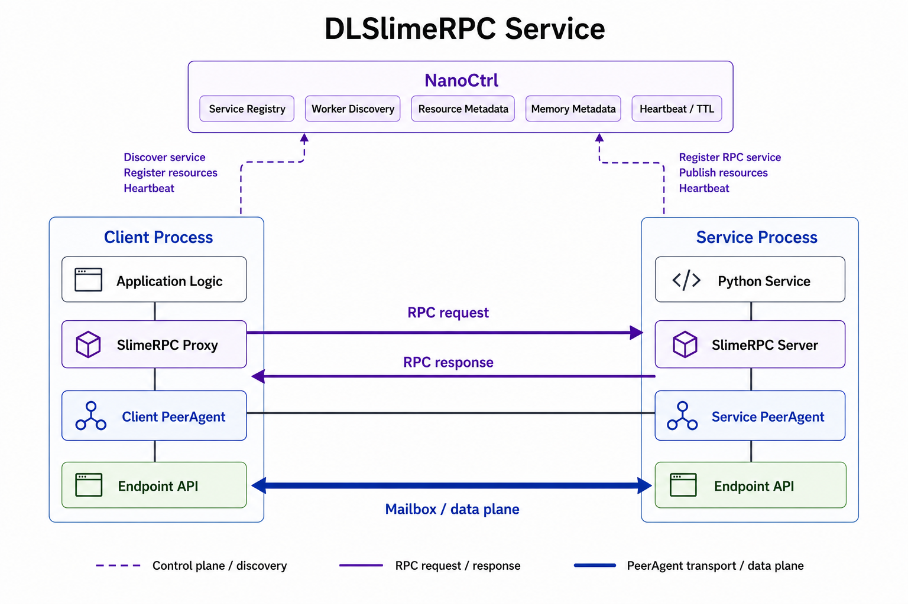

<div align="center">
  
</div>
<p align="center">
  <a href="docs/roadmap.md"> 路线图 </a> |
  <a href="https://join.slack.com/t/dlslime/shared_invite/zt-3e9zvercw-a89KI_Ig8N1UTaol_q6MXg"> Slack </a> |
  <a href="docs/imgs/assets/wechat_qrcode.jpg"> 微信群 </a> |
  <a href="https://zhuanlan.zhihu.com/p/1950701795149067622"> 知乎 </a> |
  <a href="README.md">English</a> |
  <a href="README_zh.md">中文</a>
</p>
<h2 align="center"> 面向分布式 AI 服务的可组合、可嵌入通信运行时 </h2>

DLSlime 是一个以 PeerAgent 为中心的分布式 AI 通信与微服务工具包。
PeerAgent 是运行时枢纽：SlimeRPC、DLSlimeCache 等应用服务构建在
PeerAgent 之上；NanoCtrl 围绕 PeerAgent 提供服务治理和协调元数据；
下层 endpoint API 则驱动 RDMA、NVLink、Ascend Direct 等异构传输。

DLSlime 支持按层接入：应用可以从直接使用 endpoint 开始，也可以加入
PeerAgent 协调、使用 NanoCtrl 做服务治理，或在其上构建 SlimeRPC 和
DLSlimeCache 这样的服务化组件。这些能力同时以 Python/C++ API、本地服务和
HTTP 控制面契约暴露，因此 DLSlime 可以嵌入已有的服务框架、推理系统、缓存
系统或 RL 系统，而不要求替换整套运行栈。

## PeerAgent 中心架构

DLSlime 围绕 PeerAgent 组织。应用服务挂载到 PeerAgent 上，NanoCtrl
提供服务治理和协调元数据，endpoint API 驱动底层传输引擎和设备。下图展示
这些层级关系，同时避免应用逻辑绑定到单一传输或拓扑。

<p align="center">
  
</p>

## 各层如何协同

1. 服务启动后以通用 entity 的形式注册到 NanoCtrl，例如 `kind=cache` 或
   `kind=rpc-worker`。
2. 每个服务挂载到 PeerAgent 上，而不是自己直接管理 transport state。
3. PeerAgent 将 resource record 和 memory region 注册到 NanoCtrl。
4. 客户端按 `kind` 和 scope 发现服务，并通过服务对应的 PeerAgent 访问它。
5. PeerAgent 通过 NanoCtrl/Redis 交换连接意图和内存区元数据。
6. Endpoint 对象通过 RDMA、NVLink、Ascend Direct 或所选 backend 发起实际传输。

## 使用场景

### 直接使用 Endpoint

当应用已经自行控制 peer placement、metadata exchange 和 memory lifetime 时，
可以直接使用 Endpoint API。这是 DLSlime 中最低层的使用方式：它绕过
NanoCtrl 和 PeerAgent，将应用传输逻辑直接映射到 endpoint-to-endpoint 数据移动。

<p align="center">
  
</p>

典型例子包括两进程 RDMA read/write 测试、NVLink 传输检查，以及需要显式控制
初始化过程的 backend bring-up。

示例：[p2p_rdma_rc_read.py](examples/python/p2p_rdma_rc_read.py),
[p2p_rdma_rc_write.py](examples/python/p2p_rdma_rc_write.py),
[p2p_nvlink.py](examples/python/p2p_nvlink.py) 和
[p2p_ascend_read.py](examples/python/p2p_ascend_read.py)。

```bash
python examples/python/p2p_rdma_rc_read.py
python examples/python/p2p_rdma_rc_write.py
python examples/python/p2p_rdma_rc_write_with_imm_data.py
python examples/python/p2p_rdma_rc_send_recv_gdr.py
torchrun --nproc_per_node=2 examples/python/p2p_nvlink.py
python examples/python/p2p_ascend_read.py
```

Ascend Direct 设置见
[docs/huawei_ascend/README.md](docs/huawei_ascend/README.md)。

### PeerAgent-to-PeerAgent 访问

当应用希望做点对点数据移动，但不想自己管理连接建立、内存区发现和过期状态
清理时，可以使用 PeerAgent。每个进程拥有一个 PeerAgent，通过 NanoCtrl 注册
资源，然后使用 PeerAgent facade 读写远端内存。

这条路径和直接使用 Endpoint 复用同一套数据面，但将协调工作交给 NanoCtrl
和 PeerAgent。它适合多进程服务、动态 peer 发现，以及 SlimeRPC、DLSlimeCache
这类更高层组件。

<p align="center">
  
</p>

示例：
[p2p_rdma_rc_read_ctrl_plane.py](examples/python/p2p_rdma_rc_read_ctrl_plane.py)
和
[p2p_rdma_multi_agents_ctrl_plane.py](examples/python/p2p_rdma_multi_agents_ctrl_plane.py)。

```bash
nanoctrl start
python examples/python/p2p_rdma_rc_read_ctrl_plane.py
```

### DLSlimeCache 服务

当多个 PeerAgent client 需要共享一个 RDMA-backed cache service 时，可以使用
DLSlimeCache。PeerAgent A 和 PeerAgent B 通过 NanoCtrl 发现 Cache Service，
从服务获取 cache assignment metadata，然后通过同一套 PeerAgent 和 endpoint
数据面读写 cache slabs。

在这条路径中，NanoCtrl 让 Cache Service 作为已注册服务可被发现；Cache
Service 拥有 cache memory region 和 assignment manifests；PeerAgent client
负责数据移动，而应用进程不需要内嵌 cache placement 逻辑。

<p align="center">
  
</p>

示例：[cache_client_example.py](examples/python/cache_client_example.py) 和
[dlslime-cache design](docs/design/dlslime-cache.md)。

```bash
nanoctrl start
dlslime-cache start --ctrl http://127.0.0.1:3000 \
  --host 127.0.0.1 --port 8765 --memory-size 1G

python examples/python/cache_client_example.py --url http://127.0.0.1:8765

dlslime-cache stop
```

### SlimeRPC 服务

当应用逻辑需要调用 Python service，同时希望将传输和 peer 协调留在 DLSlime
内部时，可以使用 SlimeRPC。客户端进程在自己的 PeerAgent 之上使用 SlimeRPC
proxy，服务进程在自己的 PeerAgent 之上通过 SlimeRPC server 暴露 Python
methods，NanoCtrl 负责让 RPC service 可被发现。

RPC request 和 response 由 PeerAgent transport 承载，而不是走 control plane。
这样 service invocation 保持在应用层，同时复用下层 PeerAgent、endpoint 和
mailbox 数据路径。

<p align="center">
  
</p>

示例：[rpc_example.py](examples/python/rpc_example.py) 和
[rpc_flatbuf_example.py](examples/python/rpc_flatbuf_example.py)。

```bash
nanoctrl start
python examples/python/rpc_example.py --ctrl http://127.0.0.1:3000
```

### PD 分离推理服务

当 prefill 和 decode 作为独立服务角色运行时，可以用 DLSlime 支持 PD 分离
推理。它遵循 LMDeploy DistServe 的模式：proxy 将请求路由到专门的 Prefill
和 Decode workers，Prefill 计算 prompt KV cache，Decode 生成 token，KV cache
迁移/数据面 backend 在两类角色之间传输 KV cache。

在 DLSlime 中，每个 Prefill 或 Decode worker 都可以建模为一个拥有自己
PeerAgent 的服务。NanoCtrl 按 `kind` 发现 worker 角色，保存 PeerAgent 的
resource 和 memory metadata，并让 serving proxy 或 worker 建立所需的
prefill-to-decode 连接。KV cache 传输使用 PeerAgent 和 endpoint 数据面，
不经过 control plane。

<p align="center">
  
</p>

LMDeploy 参考： [DistServe with DLSlimeBackend](https://lmdeploy.readthedocs.io/en/v0.12.2/http-routingtable.html#distserve) 和 [DistServe with MooncakeBackend](https://kvcache-ai.github.io/Mooncake/getting_started/examples/lmdeploy-integration-v0.9.html).

### RL 服务

Coming soon.

## 安装

### PyPI 安装

```bash
pip install dlslime==0.0.3.rc2
```

PyPI 包使用默认 CMake flags 构建。需要可选传输后端或本地 C++ 改动时，建议
从源码构建。

### 源码构建

```bash
git clone https://github.com/deeplink-org/DLSlime.git
cd DLSlime
pip install -v --no-build-isolation -e .
```

通过环境变量传递 CMake flags：

```bash
BUILD_NVLINK=ON BUILD_TORCH_PLUGIN=ON \
  pip install -v --no-build-isolation -e .
```

仅构建 C++：

```bash
cmake -S . -B build -GNinja -DBUILD_PYTHON=OFF -DBUILD_RDMA=ON
cmake --build build
```

### 构建选项

| Flag                  |                                       默认值 | 说明                                     |
| --------------------- | -------------------------------------------: | ---------------------------------------- |
| `BUILD_RDMA`          |                                         `ON` | 构建 RDMA 传输引擎                       |
| `BUILD_PYTHON`        | CMake 中为 `OFF`，`pyproject.toml` 中为 `ON` | 构建 Python bindings                     |
| `BUILD_NVLINK`        |                                        `OFF` | 构建 NVLink 传输引擎                     |
| `BUILD_ASCEND_DIRECT` |                                        `OFF` | 构建 Ascend Direct 传输                  |
| `BUILD_TORCH_PLUGIN`  |                                        `OFF` | 构建 DLSlime torch backend               |
| `BUILD_BENCH`         |                                        `OFF` | 构建 C++ 传输引擎 benchmark              |
| `BUILD_TEST`          |                                        `OFF` | 构建 C++ 测试                            |
| `USE_MACA`            |                                        `OFF` | 为 torch backend 构建启用 Metax 平台支持 |

## Benchmark

Benchmark 命令和历史性能表格已经移动到独立目录：

- [bench/README.md](bench/README.md) - 传输、endpoint、cache、RPC benchmark 入口
- [docs/benchmark-rpc.md](docs/benchmark-rpc.md) - SlimeRPC vs Ray benchmark 说明

常用入口：

```bash
# 两节点聚合 RDMA 传输 benchmark
torchrun --master-addr <addr> --master-port 6006 \
  --nnodes 2 --nproc-per-node 8 --node-rank <rank> \
  bench/python/agg_transfer_bench_spmd.py \
  --qp-num 8 --transfer-engine dlslime \
  --batch-size 64 --num-iteration 100 --num-concurrency 8

# SlimeRPC vs Ray 本地 benchmark
bash bench/python/run_rpc_bench.sh
```

## 仓库结构

```text
dlslime/   核心 Python package、C++ bindings 和传输/运行时 primitives
NanoCtrl/  服务治理控制面
examples/  Endpoint、PeerAgent、cache 和 RPC 示例
bench/     Benchmark 脚本和 benchmark README
docs/      设计文档、路线图和平台说明
tests/     Python 和 C++ 测试
```

## 文档

- [文档索引](docs/README.md)
- [路线图](docs/roadmap.md)
- [DLSlimeCache 设计](docs/design/dlslime-cache.md)
- [Endpoint ownership model](docs/endpoint-ownership-model.md)
- [Endpoint DeviceSignal refactor](docs/endpoint-device-signal-refactor.md)
- [华为 Ascend 说明](docs/huawei_ascend/README.md)
- [English README](README.md)

## License

See [LICENSE](LICENSE).
