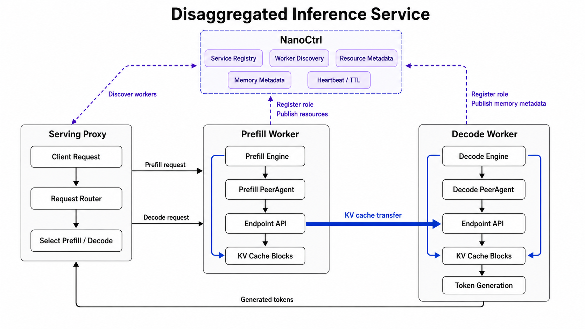

# Architecture

DLSlime is organized around PeerAgent. Application services attach to
PeerAgent, NanoCtrl provides service governance and coordination metadata, and
endpoint APIs drive the underlying transfer engines and devices.

## How The Layers Work Together

1. A service starts and registers itself with NanoCtrl as a generic entity, for
   example `kind=cache` or `kind=rpc-worker`.
2. Each service attaches to a PeerAgent instead of managing transport state
   directly.
3. PeerAgents register their resource records and memory regions with NanoCtrl.
4. Clients discover services by `kind` and scope, then reach the service
   through its PeerAgent.
5. PeerAgents exchange connection intent and memory-region metadata through
   NanoCtrl and Redis.
6. Endpoint objects issue the actual transfer through RDMA, NVLink, Ascend
   Direct, or the selected backend.

## Usage Scenarios

### Direct Endpoint Access

Use the Endpoint API directly when the application already controls peer
placement, metadata exchange, and memory lifetime.

### PeerAgent-to-PeerAgent Access

Use PeerAgent when the application wants peer-to-peer data movement without
managing connection setup, memory-region discovery, and stale-state cleanup by
itself.

### DLSlimeCache Service

Use DLSlimeCache when multiple PeerAgent clients need a shared RDMA-backed cache
service.

### SlimeRPC Service

Use SlimeRPC when application logic should call a Python service while keeping
transport and peer coordination inside DLSlime.

### Disaggregated Inference Service

Use DLSlime for disaggregated inference when prefill and decode run as separate
serving roles.
