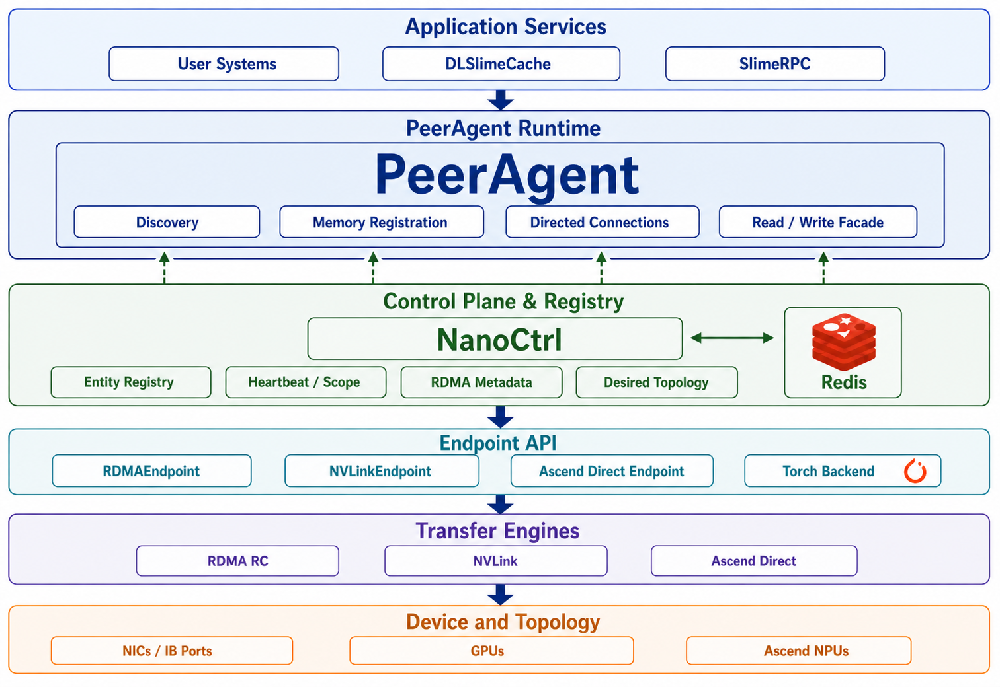
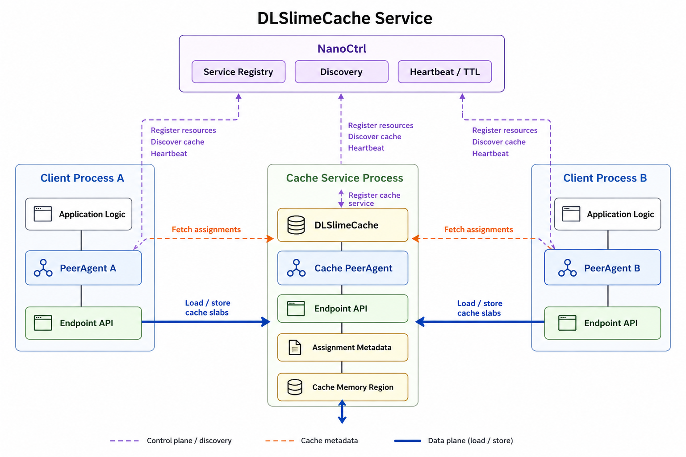

# 架构

DLSlime 以 PeerAgent 为中心组织系统。应用服务接入 PeerAgent，NanoCtrl 提供服务治理和协调元数据，
Endpoint API 负责驱动底层传输引擎和设备。

## 层次如何协作

1. 服务启动后向 NanoCtrl 注册为通用实体，例如 `kind=cache` 或 `kind=rpc-worker`。
2. 每个服务接入 PeerAgent，而不是直接管理所有传输状态。
3. PeerAgent 向 NanoCtrl 注册资源记录和内存区域。
4. 客户端按 `kind` 和 `scope` 发现服务，并通过对应 PeerAgent 访问。
5. PeerAgent 通过 NanoCtrl 和 Redis 交换连接意图与内存区域元数据。
6. Endpoint 对象通过 RDMA、NVLink、Ascend Direct 或选定后端执行实际传输。

## 典型场景

### 直接使用 Endpoint

应用已经管理 peer 放置、元数据交换和内存生命周期时，可以直接使用 Endpoint API。

### PeerAgent 到 PeerAgent

应用希望 DLSlime 处理连接建立、内存区域发现和过期状态清理时，可以使用 PeerAgent。

### DLSlimeCache 服务

多个 PeerAgent 客户端需要共享 RDMA-backed cache service 时，可以使用 DLSlimeCache。

### SlimeRPC 服务

希望通过 Python 服务调用表达应用逻辑，同时复用 DLSlime 传输和 peer 协调时，可以使用 SlimeRPC。
